### klee tutorial1 实验汇报
KLEE：
>KLEE是一款开源的自动软件测试工具，基于LLVM编译底层基础，能够自动生成测试样例检测软件缺陷。

>与junit不同的地方在于，KLEE能对c程序生成字节码.bc文件，并自动生成各类缺陷，不需要再自己编写。因而使用KLEE进行软件测试是比较轻松的方式。

KLEE安装
Building KLEE with LLVM 6.0(放弃)
在安装KLEE之前，需要先安装一个名叫Docker的软件，Docker能创建与系统其他部分隔绝的容器，可以理解为一个简单的虚拟机。利用Docker可以为KLEE开辟容器空间，在容器内可以进行自己所需的软件测试工作。

```
$ docker pull klee/klee
```
##### KLEE的使用 ：
*1、创建基本画像*
>所谓画像就是创建一个库，可以将Docker理解为一个可以运送各种物品的大货船，装有不同的物品的货箱用不同颜色标明，KLEE是其中一种物品，假设它是装食物的、蓝色的箱子，每创建一个库，就相当于货船上增加了一个蓝色的箱子。

```
$ docker run --rm -ti --ulimit='stack=-1:-1' klee/klee
```
输入后进入临时画像，可以继续使用shell命令
输入  exit  退出临时画像，--rm参数，在我们退出后容器会销毁，因此是临时的。

*2、创建永久画像（容器）*
```
$ docker run -ti --name=my_first_klee_container --ulimit='stack=-1:-1' klee/klee:2.0
```

这里我们没有用--rm参数，因此创建了永久容器。同时，这里用--name参数指定了容器的名字。--ulimit参数是为了防止堆栈溢出问题。
```
$ exit
$ docker ps -a
```
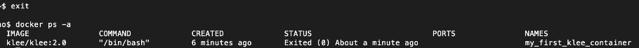

重新再进入容器
```
$ docker start -ai my_first_klee_container
```
若想删除，可以用命令：
$ docker rm my_first_klee_container

这个 程序一般在 examples/get_sign目录下，用来判断一个整数的正，负，或者为0。
```
#include <klee/klee.h>
 
int get_sign(int x) {
  if (x == 0)
     return 0;
  
  if (x < 0)
     return -1;
  else 
     return 1;
} 
 
int main() {
  int a;
  klee_make_symbolic(&a, sizeof(a), "a");
  return get_sign(a);
}
```
其中，klee_make_sybolic是KLEE自带的函数，用来产生符号化的输入。

因为KLEE是在LLVM字节码上进行工作，所以我们首先需要将.c编译为LLVM字节码,使用clang -emit-llvm将其编译为LLVM位代码。
首先，我们进入到该文件目录（~/klee_src/examples/get_sign）下执行命令
```
clang -I ../../include -emit-llvm -c -g -O0 -Xclang -disable-O0-optnone get_sign.c
```
其中，参数-I是为了编译器找到头文件klee/klee.h,-g是为了在字节码文件中添加debug信息

-O0 -Xclang -disable-O0-optnone用于进行编译而不会进行任何优化，但不会阻止KLEE进行自身的优化，而使用-O0进行编译则是最优化的

同目录下我们会生成一个get-sign.bc的字节码文件，然后进行测试：
```
$ klee get_sign.bc
```  


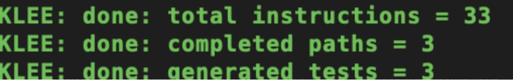
可以看到结果中KLEE给出了总指令数，完整路径和生成的测试案例数。

最后，我们看当前目录下多生成了两个文件：klee-last 和 klee-out-0。其中klee-out-0是本次测试结果，klee-last是最新测试结果，每次测试后覆盖。

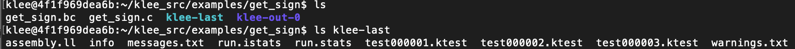


####  tutorial 2程序测试实例
```
#include<stdio.h>
#include<stdlib.h>
 
void kleeTest(int a){
  int arr[10];
  int d[10];
 
  for (int i = 0; i < 10; i++){ //赋初始值
    arr[i] = i;
  }
 
  if (a < -50){  //求余分母为0
    for (int i = 0; i < 10; i++){
      int num = i;
      d[i] = arr[i] % num;
    }
  }
  else if(a < -25){  //除法分母为0
    for (int i = 0; i <= 10; i++){
      int num = i ;
      d[i] = arr[i] / num;
    }
  }
  else if (a < 0){  //数组越界
    for(int i = 0; i<= 11; i++){
      arr[i] = i;
    }
  }
  else if (a < 25){  //空指针
    int *a = NULL;
    int b = *a + 1;
  }
  else if(a < 50){  //内存泄漏
    free(arr);
  }
}
 
int main(){
  int n;
  klee_make_symbolic(&n, sizeof(n), "n");
  kleeTest(n);
  return 0;
}
```
首先，我们需要把实例拷贝到Docker容器中去，需要用到Docker cp命令
命令格式为：$ docker cp /host/path/target <containerId>:/file/path/within/container

以我为例：
```
$ docker cp /Users/nancy/Desktop/mytest.c my_first_klee_container:/home/klee/klee_src/examples/get_sign
```
/Users/nancy/Desktop/mytest.c 为我的实例程序路径

/home/klee/klee_src/examples/get_sign为目标路径

my_first_klee_container为容器名字

完成拷贝后，我们可以进入到容器中查看：
```
$ docker start -ai my_first_klee_container
$ ls /home/klee/klee_src/examples/get_sign/
```
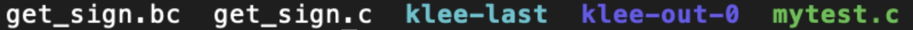

可以看到，mytest.c已经成功拷贝至容器目标路径下。

接下来，按照我们之前官方教程一样操作:1.进入到文件目录；2.clang编译为字节码；3.klee编译

```
$ cd /home/klee/klee_src/examples/get_sign/
$ clang -I ../../include -emit-llvm -c -g -O0 -Xclang -disable-O0-optnone mytest.c
$ klee mytest.bc
```

可以看到结果，给出了错误类型及对应的源程序位置以及指令、路径、生成的用例数。
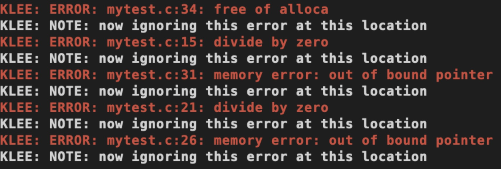
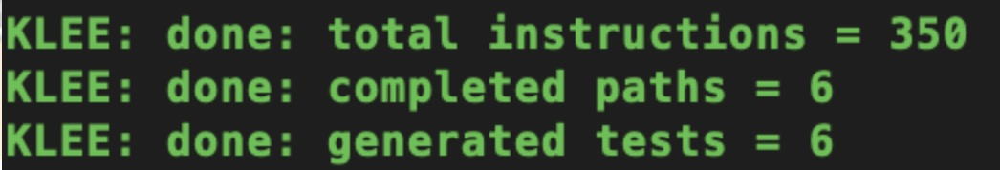


看下得到的测试文件
```
$ ls klee-last
```
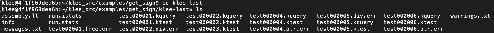

可以看到，对应每个test主要有两种后缀文件。其中test000001.ktest文件是KLEE生成的测试用例，是二进制文件，可以用ktest-tool打开
```
$ ktest-tool klee-last/test000001.ktest
```
可以看到结果，对于第一个用例，给的输入是25。同理可以查看第二个和第三个测试用例，用同样的 方法。

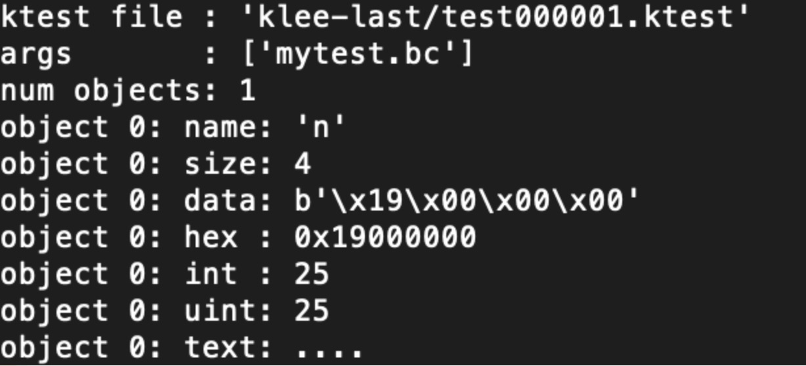

而其他后缀结尾的，包括.free,err、.div,err等，则是对应错误的相关信息，我们可以将他们复制到自己主机上进行查看。
```
$ docker cp <containerId>:/file/path/within/container   /host/path/target
```
然后用文本格式打开，可以看到类似以下信息，包括错误的位置以及原因：
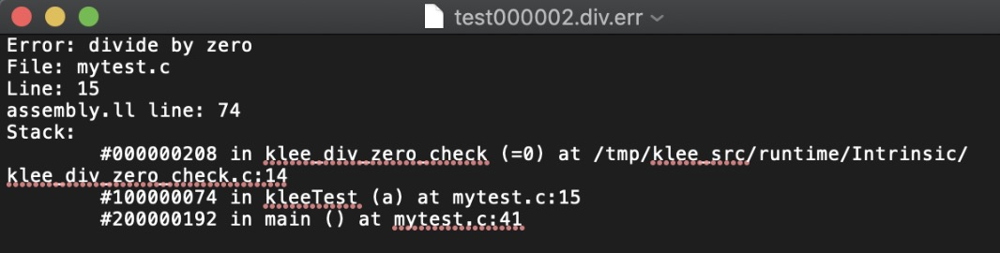


#### tutorial3 象征迷宫
           +-+ --- + --- +
           | X | |＃|
           | | -+ | |
           | | | | |
           | +-| | |
           | | |
           + ----- + --- +

编程玩家移动的方式
“ w”，“ s”，“ a”或“ d”的序列
尝试获得奖品（＃）！
这场比赛是在用C编码的微型迷宫游戏与成熟的基于LLVM的符号执行引擎KLEE之间进行的。

##### 一共有几个解决方案？
##### 1、解析代码 ，首先，它将地图硬编码为静态的全局rw变量。

```
＃define H 7
＃define W 11
char maze[H] [W] = {“ +-+ --- + --- +”，
                    “ | | |＃|”，
                    “ | |-+ | |”，
                    “ | | | | |”，
                    “ | +-| | |”，
                    “ | | |”，
                    “ + ----- + --- +”};
```
设置方便的功能以在屏幕上绘制迷宫状态：
```
void draw（）
{
	int i，j;
	for（i = 0; i <H; i ++）
	  {
		  for（j = 0; j <W; j ++）
				  printf（“％c”，maze [i] [j]）;
		  printf（“ \ n”）;
	  }
	printf（“ \ n”）;
}
```

在主要功能上，有一些局部变量来保存“玩家”的位置，迭代计数器和28bytes的动作数组。
```
int main（int argc，char * argv []）
{
    intx，y; //玩家位置
    int ox，oy; //老玩家位置
    int i = 0; //迭代次数
    #define ITERS 28
    char program[ITERS]；
```

初始玩家位置设置为（1,1），即地图中的第一个空闲单元。而玩家“ sprite”是字母“ X”
```
    x = 1；
    y = 1；
    maze [y] [x] ='X';
```
至此，我们准备开始！所以它要求方向。它一次读取所有动作作为一个字符数组。它将最多执行ITERS迭代或命令。
```
raed（0，program，ITERS）;
```

现在，它遍历变量“程序”中的动作数组。
```
    while（i <ITERS）
      {
        ox = x; //保存旧玩家位置
        oy = y;
```

不同的动作会改变播放器在不同轴和方向上的位置。照常”; a是左，d是右，w是上，s是下。
```
  switch (program[i])
        {
            case 'w':
                        y--;
                break;
            case 's':
                        y++;
                break;
            case 'a':
                        x--;
                break;
            case 'd':
                        x++;
                break;
            default:
                        printf("Wrong command!(only w,s,a,d accepted!)\n");
                        printf("You lose!\n");
                        exit(-1);
        }
```
检查是否中奖了！如果是……您赢了！
```
       if (maze[y][x] == '#')
        {
                printf ("You win!\n");
                printf ("Your solution \n",program);
                exit (1);
        }
```

如果出了问题，请不要继续前进，返回到保存状态！

``` if (maze[y][x] != ' ' &&
            !((y == 2 && maze[y][x] == '|' && x > 0 && x < W)))
		    {
			    x = ox;
			    y = oy;
		    }
```

如果撞到墙上或无法动弹！退出，你输了！
```
       if (ox==x && oy==y){
                printf("You lose\n");
                exit(-2);
        }
```
基本上，如果我们移动，将播放器放在地图上的正确位置。并绘制新状态。
```
        maze[y][x]='X';
        draw ();          //draw it
```
递增迭代计数器（用于选择数组中的下一个动作），等待一秒钟然后循环。
```
        i ++;
        sleep(1); //me wait to human
    }
```
如果到目前为止您还没有赢..您会输。
```
printf（“you lose\ n”）;

```

##### 2、用手操作

自己尝试：wwwssssddddwwaawwddddssssddwwww可以获胜
使用LLVM的maze.C的便宜和测试周期是这样的：
```
llvm-gcc -c -Ipath / to / klee –emit-llvm maze_klee.c -o maze_klee.bc
klee maze.bc
```

现在，KLEE将从任何输入中找到所有可能的代码/迷宫路径。
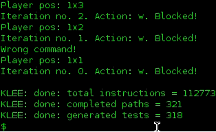
KLEE：完成：总指令= 112773
KLEE：完成：完整路径= 321
KLEE：完成：生成的测试= 318

并将测试用例生成以将其全部生成到klee-last文件夹中
图
```
$ls klee-last/
assembly.ll test000078.ktest test000158.ktest
info test000079.ktest test000159.ktest
messages.txt test000080.ktest test000160.ktest
run.istats test000081.ktest test000161.ktest
run.stats test000082.ktest test000162.ktest
test000001.ktest test000083.ktest test000163.ktest
test000075.ktest test000155.ktest warnings.txt
```
可以使用ktest-tool这样检索每个测试用例
图
```
$ktest-tool klee-last/test000222.ktest
ktest file : ‘klee-last/test000222.ktest’
args : [‘maze_klee.o’]
num objects: 1
object 0: name: ‘program’
object 0: size: 29
object 0: data: ‘ssssddddwwaawwddddssssddwwwd\x00’
```
因此，在这种情况下，可以将输入内容输入到原始迷宫中，然后检查它的作用。

好的，到目前为止，还不错，但是我不是ktest-tooling每个可能的测试用例，而是检查它是否是迷宫解决方案！我们需要一种让KLEE的方法来帮助我们区分正常的测试用例，而不是那些实际达到“您赢了！”的用例。

##### 如何标记我们感兴趣的代码部分？
有一个klee_assert（）函数几乎可以执行与普通C断言相同的操作，它会强制条件为true，否则将中止执行！一种标记某些程序部分（带有断言）的方法，以便KLEE到达时会提醒。

在代码中，这是通过替换此行来完成的……
printf ("You win!\n");

被这俩替换：
printf ("You win!\n");
klee_assert(0);  //Signal The solution!!

现在，当KLEE达到“您获胜状态”（这意味着“玩家”命中“＃”）时，它会断言综合失败。好的，如果将其编译为LLVM并在新版本上运行KLEE，则它将一个测试用例标记为也是一个错误...

图
```
$ls -1 klee-last/ |grep -A2 -B2 err
test000096.ktest
test000097.ktest
test000098.assert.err
test000098.ktest
test000098.pc
```
让我们看看什么是触发此错误/迷宫解决方案的输入…

图
```
$ ktest-tool klee-last / test000098.ktest
ktest文件：'klee-last / test000098.ktest'args
：['maze_klee.o']
num个对象：1个
对象0：名称：'program'
对象0：大小：29
对象0：数据：'sddwddddsssddwwww \ x00 \ x00 \ x00 \ x00 \ x00 \ x00 \ x00 \ x00 \ x00 \ x00 \ x00'
```

让我们在原始迷宫上尝试输入..

典型！！有假墙！KLEE顺利通过了它！
但是，这会不会代表着它是否未找到所有可能的解决方案？为什么KLEE无法找到它？

在大多数情况下（显然），只需要一种方法即可达到错误状态，因此KLEE不会向您显示达到相同错误状态的其他方法。我们非常需要使用10000 KLEE 选项之一。我们需要像这样运行它。
```
$klee –emit-all-errors maze_klee.o
```
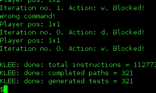

它提供了4种不同的“解决方案”…
```
$ktest-tool klee-last/test000097.ktest
ktest file : ‘klee-last/test000097.ktest’
args : [‘maze_klee.o’]
num objects: 1
object 0: name: ‘program’
object 0: size: 29
object 0: data: ‘sddwddddsddw\x00\x00\x00\x00\x00\x00\x00\x00\x00\x00\x00\x00\x00\x00\x00\x00\x00’
$ktest-tool klee-last/test000136.ktest
ktest file : ‘klee-last/test000136.ktest’
args : [‘maze_klee.o’]
num objects: 1
object 0: name: ‘program’
object 0: size: 29
object 0: data: ‘sddwddddssssddwwww\x00\x00\x00\x00\x00\x00\x00\x00\x00\x00\x00’
$ktest-tool klee-last/test000239.ktest
ktest file : ‘klee-last/test000239.ktest’
args : [‘maze_klee.o’]
num objects: 1
object 0: name: ‘program’
object 0: size: 29
object 0: data: ‘ssssddddwwaawwddddsddw\x00\x00\x00\x00\x00\x00\x00’
$ktest-tool klee-last/test000268.ktest
ktest file : ‘klee-last/test000268.ktest’
args : [‘maze_klee.o’]
num objects: 1
object 0: name: ‘program’
object 0: size: 29
object 0: data: ‘ssssddddwwaawwddddssssddwwww\x00’
```
有4种可能的解决方案！！
wwwssssddddwwaawwddddssssddwwww
ssssddddwwaawwddddsddw
wwwwww.sddwddddssssddwwww
sddwddddsddw


