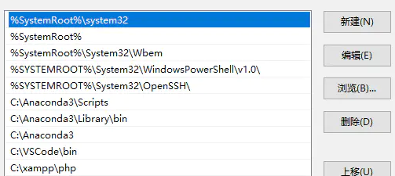
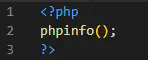
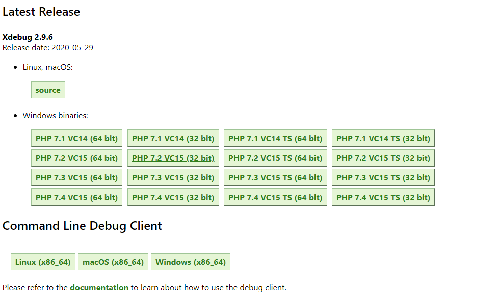
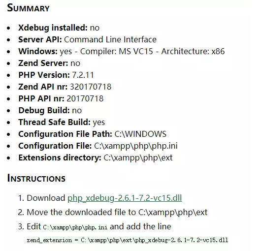
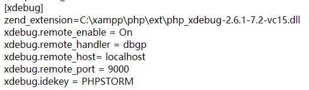
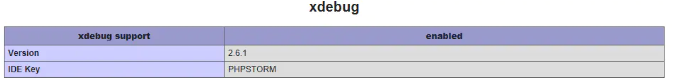
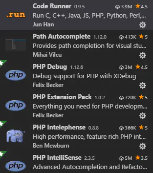
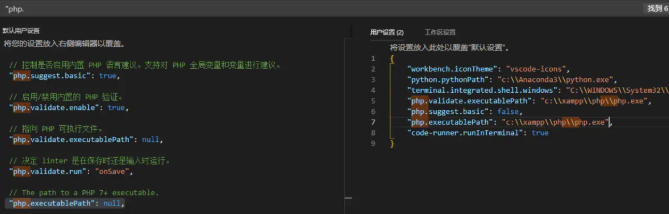
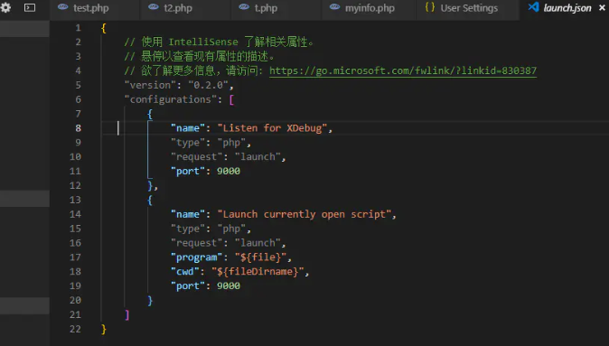
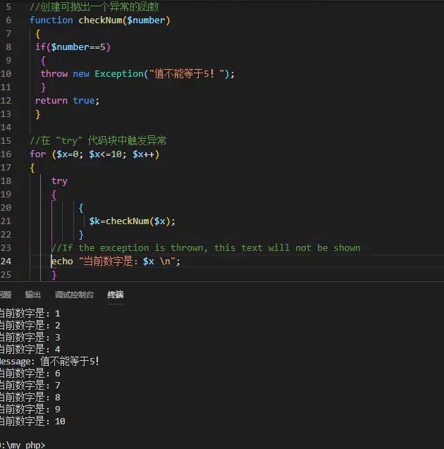

### 实验要求
编写网页漏洞，让他进行xss攻击

#### 实验过程

#### 在vscode中搭建php开放环境
1、下载xampp
在官网下载xampp，选择php7.x版本

原因:

1.PHP 7 改变了大多数错误的报告方式。不同于传统（PHP 5）的错误报告机制，现在大多数错误被作为 Error 异常抛出。--老版本的坑太多了，而且php与其他语言不一样，捕捉异常和错误真是哥技术活，具体可以参考再谈php异常与错误处理一文。

2.vscode不支持php7以下版本的调试

安装后，将把php.exe所在文件夹添加进系统变量path中



检查是否安装成功：


2、配置Xdebug

注意下载页面中 custom installation instructions：

点击进入后，在如下的框中，填入 php配置全部内容，
php的配置情况，用：
php -i

提交后，返回的内容如下：


即可下载合适的.dll文件并配置xdebug:


重新启动Apache后，再用phpinfo()检查，OK!


3、配置VScode
安装常用插件：


配置环境
设置路径：

需要在VSCode设置中修改php.suggest.basic为false，这是一个VSCoed自带的PHP智能检测插件，为防止和第三方插件之间造成冲突所以需设置为false。

xdebug 的配置
在 vs code 的 debug 界面开启调试，选择添加 xdebug 的配置:


注意远程端口要和php.ini中的设置一致。

测试一下：


#### 网页代码
```
<!DOCTYPE html>
<html>
<head>
    <meta charset="UTF-8">
    <title>Weak Website</title>
</head>
<body>
    <form method="post">
        <input type="text" name="xss">
        <input type="submit" value="提交">
    </form>
    <?php
        if(isset($_POST["xss"]))
        {
            echo $_POST["xss"];
        }
    ?>
</body>
</html>
```
这里有一个用户提交的页面，用户可以在此提交数据，数据提交之后给后台处理

##### 存储型xss攻击

实验需要用到的工具：mysql+php+apache
```
//前端
<html>
<head lang="en">
    <meta charset="UTF-8">
    <title>XSS</title>
</head>
<body>
    <form action="action2.php" method="post">
       ID  <input type="text" name="id" /> <br/>
        Name<input type="text" name="name" /> <br/>
        <input type="submit" value="submit">
    </form>
</body>
</html>
//后端：action2.php
<?php
	$id=$_POST["id"];
	$name=$_POST["name"];
	$con=mysqli_connect("localhost","root","123456");
	mysqli_select_db($con,"test");
	
	$sql="insert into xss value ($id,'$name')";
	$result=mysqli_query($con,$sql);
?>
//供其他用户访问页面：show2.php
<?php
	$con=mysqli_connect("localhost","root","123456");
	mysqli_select_db($con,"test");
	$sql="select * from xss where id=1";
	$result=mysqli_query($con,$sql);
	while($row=mysql_fetch_array($result)){
		echo $row['name'];
	}
?>
```

这里有一个用户提交的页面，数据提交给后端之后，后端存储在数据库中。然后当其他用户访问另一个页面的时候，后端调出该数据，显示给另一个用户，XSS代码就被执行了


我们输入 1 和 <script>alert(\'hack\')</script> ，注意，这里的hack的单引号要进行转义，因为sql语句中的$name是单引号的，所以这里不转义的话就会闭合sql语句中的单引号。不然注入不进去。提交了之后，我们看看数据库


然后当其他用户访问 show2.php 页面时，我们插入的XSS代码就执行了，也就意味着我们存储型XSS攻击成功了

