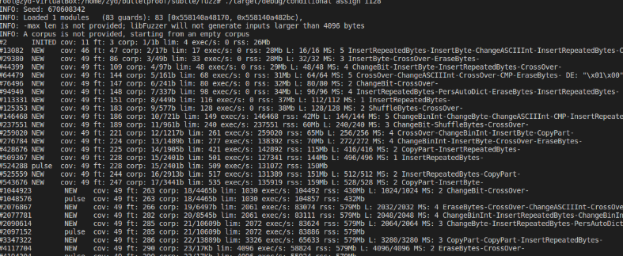

### fuzzing模糊测试理解

##### 定义

通过向被测目标输入大量的畸形数据并检测其异常来发现漏洞

##### 使用工具及测试阶段
Peach、Sulley、Autodafe、SPIKE等

##### 确定测试目标；
确定输入向量；是否能找到所有的输入向量是模糊测试能否成功的关键；
生成模糊测试数据；
执行模糊测试数据；
监视异常：对异常错误进行监视，以便于找到触发faults的数据；
判定发现的漏洞是否可以被利用：需要手工判断；
局限性
访问控制漏洞：模糊测试无法识别应用程序本身的权限问题
糟糕的设计逻辑：模糊测试无法识别发现的问题是否是由于安全问题造成的
后门：模糊测试无法识别是否是后门功能
破坏：SIGSEGV信号会导致模糊测试无法识别是否触发内存破坏
多阶段安全漏洞：模糊测试对识别单个漏洞很有用，但对小的漏洞链构成的漏洞则作用不大

##### Fuzz test example
以https://github.com/dalek-cryptography/subtle为例：

```
cd fuzz
cargo rustc --bin conditional_assign_i128 -- -C passes='sancov' -C llvm-args='-sanitizer-coverage-level=3' -Z sanitizer=address
./target/debug/conditional_assign_i128 ##开始fuzz测试
```

其中fuzz测试打印信息含义可参见：http://llvm.org/docs/LibFuzzer.html#output

参考资料：
[1] https://en.wikipedia.org/wiki/Fuzz_testing
[2] https://www.freebuf.com/column/157277.html
[3] https://github.com/kudelskisecurity/cdf
[4] http://llvm.org/docs/LibFuzzer.html#output
[5] https://rust-fuzz.github.io/book/cargo-fuzz/tutorial.html
