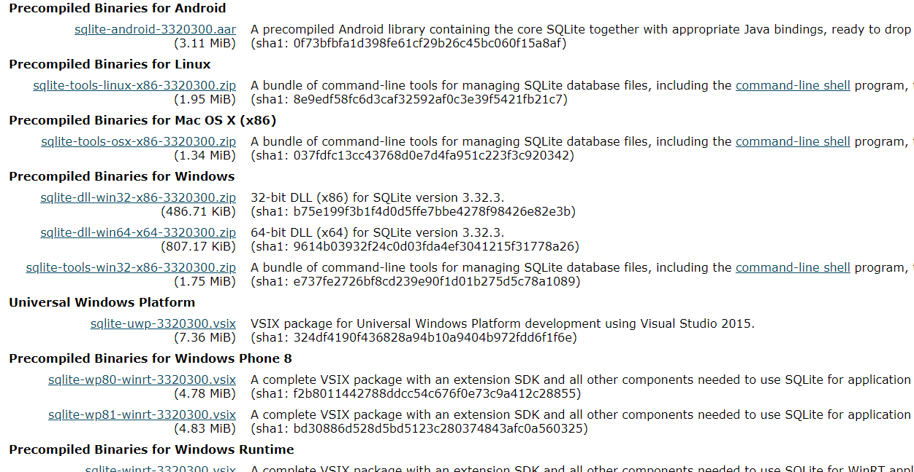
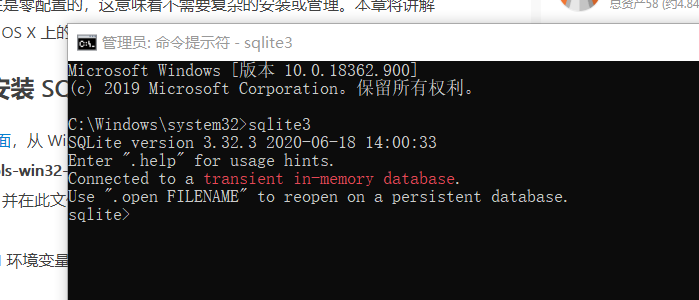

### web sqlite开发

使用工具：
sqlite、vscode

#### sqlite安装步骤
访问官网：https://www.sqlite.org/download.html

需要下载 sqlite-tools-win32-*.zip 和 sqlite-dll-win32-*.zip 压缩文件
创建文件夹 D:\sqlite，并在此文件夹下解压上面两个压缩文件，将得到 sqlite3.def、sqlite3.dll 和 sqlite3.exe 文件
添加 D:\sqlite 到 PATH 环境变量，最后在命令提示符下，使用 sqlite3 命令，将显示如下结果。



#### 实验要求
- 一个是教师录入成绩页面的表单有三个字段，课程id，学生id，成绩。教师录入成绩提交以后，httpserver调用sqlite库使用sql语句写入数据库
  - 一个是学生查询成绩页面的表单有两个字段，学生id，课程id。学生输入信息后，httpserver使用sql语句查询成绩后返回给用户
  - 不需要做登录功能，课程用直接输入id的方式，而不是下拉菜单的方式或者其他选择的方式

  ### sqlite的使用

- 创建一个数据库名为`edu_admin.db`，并且新建`teacher`表格
- 指定数据类型，~~忽略下面的数据类型~~

    

- 在sqlite数据库中创建表格字段的时候，允许不为字段申明数据类型
- 代码如下所示，具体见[dbinstruction.py](./code/dbinstructions.py)文件
    ```py
    # -*- coding: utf-8 -*-
    import sqlite3
    conn = sqlite3.connect('./edu_admin.db')
    c = conn.cursor()

    # Create teacher table 
    c.execute('''CREATE TABLE teacher(courseid,studentid,grade)''')
    # Insert a row of data
    # c.execute("INSERT INTO teacher VALUES ('1','1','90')")
    # Save (commit) the change
    conn.commit()
    # We can also close the connection if we are done with it.
    # Just be sure any changes have been committed or they will be lost.
    conn.close()
    ```


#### 代码讲解

```py
# -*- coding: utf-8 -*-

import sys
import cgi
from http.server import HTTPServer, BaseHTTPRequestHandler
import sqlite3

# 教师往数据库插入学生成绩
# 数据库为python自带轻量级数据库sqlite
def insert_into_db(course_id,student_id,grade):
    print("insert database")
    conn = sqlite3.connect('./edu_admin.db')
    c = conn.cursor()
    try:
        c.execute("select * from teacher where courseid = %s and studentid = %s " % (course_id,student_id))
        jud = c.fetchall()
        # 如果学生已有成绩，不允许重复插入
        if len(jud) == 0:
            c.execute("INSERT INTO teacher VALUES (%s,%s,%s)" %(course_id,student_id,grade))
            # Save (commit) the change
            conn.commit()
    except:
        print("already exist")
        conn.rollback()
    conn.close()

# 学生从数据库中查询成绩信息
def select_from_db(course_id,student_id):
    print("select database")
    conn = sqlite3.connect('./edu_admin.db')
    c = conn.cursor()
    try:
        c.execute("select * from teacher where courseid = %s and studentid = %s " % (course_id,student_id))
        res = c.fetchall()
        # 没有查到该学生的成绩
        if len(res) == 0:
            print("no student / no course")
            conn.close()
            return "error"
        else:
            conn.close()
            return res
    except:
        print("error")
        conn.close()
        return "error"

class MyHTTPRequestHandler(BaseHTTPRequestHandler):
    
    course_id = 'course_id'
    student_id = 'student_id'
    grade = 'grade'
    
    def do_GET(self):
        
        print("get success")

        path = self.path
        print(path)
        if path == "/grade":
            form_html = \
                '''
                <html>
                <body>
                <form method='post' enctype='multipart/form-data'>
                query the scores </br>
                course id:</br>
                <input type='text' name='%s'></br>
                student id:</br>
                <input type='text' name='%s'></br>
                <input type='submit'>
                </form>
                </body>
                </html>
                ''' % ('course_id','student_id')
            
            self.send_response(200)
            self.send_header("Content-type", "text/html")
            self.end_headers()
            self.wfile.write(form_html.encode())
                
        elif path == "/teacher": 
            form_html = \
                '''
                <html>
                <body>
                <form method='post' enctype='multipart/form-data'>
                course id:</br>
                <input type='text' name='%s'></br>
                student id:</br>
                <input type='text' name='%s'></br>
                grade:<br>
                <input type='text' name='%s'></br>
                <input type='submit'>
                </form>
                </body>
                </html>
                ''' % ('course_id','student_id','grade')
                
            self.send_response(200)
            self.send_header("Content-type", "text/html")
            self.end_headers()
            self.wfile.write(form_html.encode())

    def do_POST(self):
        print("post success")
        form_data = cgi.FieldStorage(
            fp=self.rfile,
            headers=self.headers,
            environ={
                'REQUEST_METHOD': 'POST',
                'CONTENT_TYPE': self.headers['Content-Type'],
            })
        fields = form_data.keys()
        # 需要判断是哪个页面进行了提交
        if len(fields) == 2:
            if self.course_id in fields and self.student_id in fields:
                course = form_data[self.course_id].value
                print(course)
                student = form_data[self.student_id].value
                print(student)
                # database
                res = select_from_db(course,student)
                print(res)
            
                if res == "error":
                    self.send_response(200)
                    self.send_header("Content-type", "text/html")
                    self.end_headers()
                    self.wfile.write(b"<html><body>query error </body></html>")
                else:
                    result = res[0]
                    result = result[2]
                    self.send_response(200)
                    self.send_header("Content-type", "text/html")
                    self.end_headers()
                    str = "<html><body>scores: %s </body></html>" % result
                    self.wfile.write(str.encode())
        else :
            if self.course_id in fields and self.student_id in fields and self.grade in fields:
                course = form_data[self.course_id].value
                print(course)
                student = form_data[self.student_id].value
                print(student)
                gra = form_data[self.grade].value
                print(gra)
                # file = open("."+self.path, "wb")
                # file.write("course_id: %s student_id: %s grade: %s \n" % (course,student,gra))
                
                # database
                insert_into_db(course,student,gra)

            self.send_response(200)
            self.send_header("Content-type", "text/html")
            self.end_headers()
            self.wfile.write(b"<html><body>OK</body></html>")

# MyHTTPServer类，是继承自原生的HTTPSever
class MyHTTPServer(HTTPServer):
    def __init__(self, host, port):
        print("run app server by python!")
        HTTPServer.__init__(self,  (host, port), MyHTTPRequestHandler)

# 程序入口
# 主函数沿用老师代码
if '__main__' == __name__:
    server_ip = "127.0.0.1"
    server_port = 8080
    if len(sys.argv) == 2:
        server_port = int(sys.argv[1])
    if len(sys.argv) == 3:
        server_ip = sys.argv[1]
        server_port = int(sys.argv[2])
    print("App server is running on http://%s:%s " % (server_ip, server_port))

    server = MyHTTPServer(server_ip, server_port)
    server.serve_forever()
```

### 结果显示

- 运行的时候需要在打开同目录下code目录作为根目录运行，
  
  在vs下可以cd code，然后code .打开新的窗口运行
  
- 插入，查询

- 进行存储型的xss攻击，这个代码由于插入使用的是%s，所以该条含有html标签的代码是无法被插入到数据库中
  - 但是如果程序未作处理，用户向数据库中写入恶意代码，还是能够展现在页面上，实现xss攻击。所以要在代码的处理和数据库两方面进行要求，防范xss等攻击

  - SQLite最大的特点在于其数据类型为无数据类型(typelessness)。这意味着可以保存任何类型的数据到所想要保存的任何表的任何列中，无论这列声明的数据类型是什么。虽然在生成表结构的时候，要声明每个域的数据类型，但SQLite并不做任何检查，开发人员要靠自己的程序来控制输入与读出数据的类型

